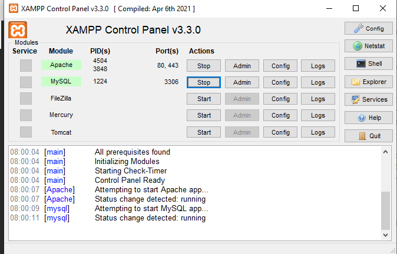
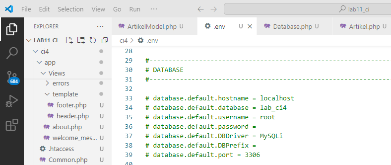
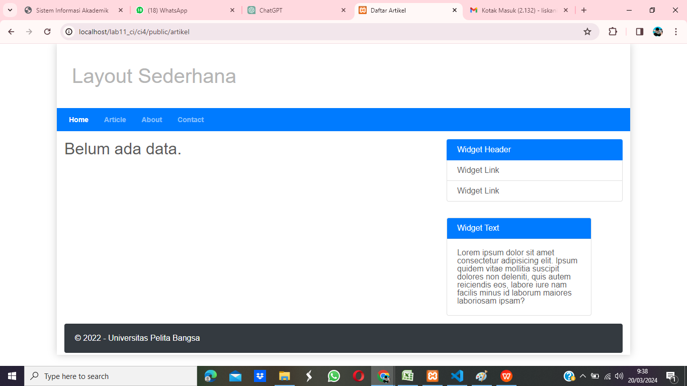
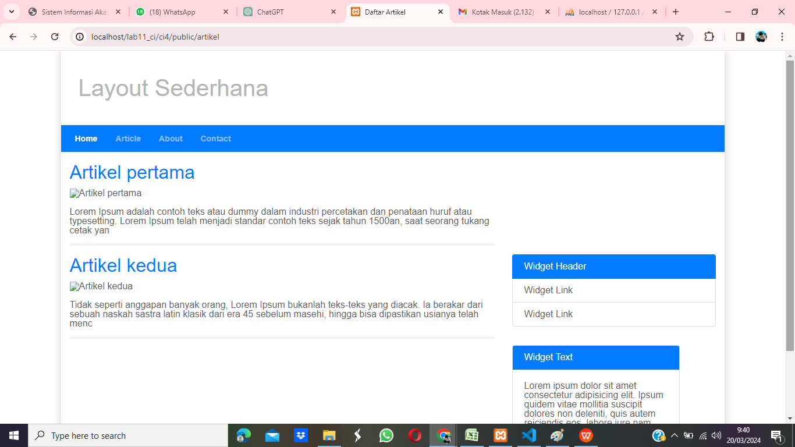
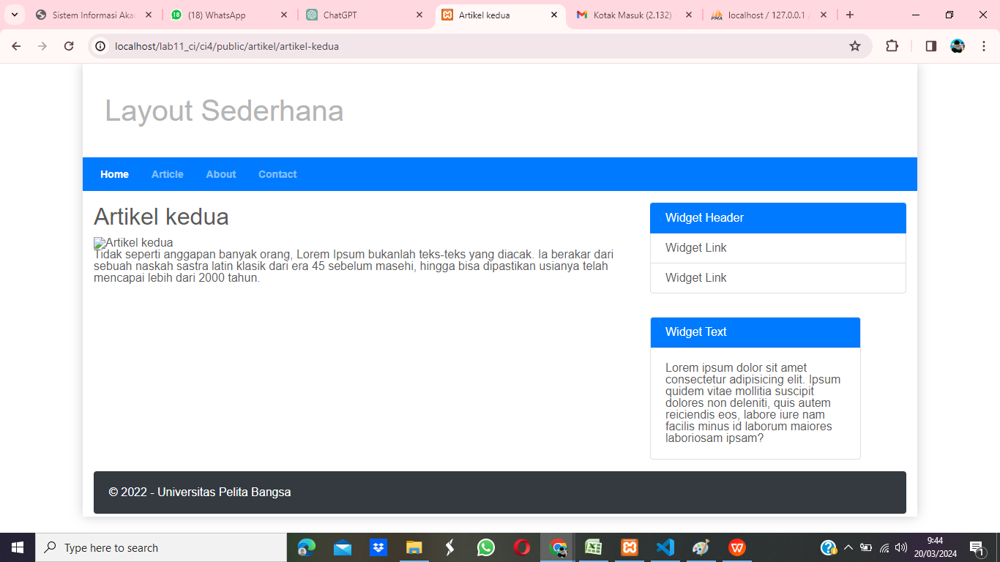

# FRAMEWORK (CRUD)

Framework CRUD adalah kerangka kerja (framework) yang dirancang khusus untuk memudahkan pembuatan, pemeliharaan, dan manajemen aplikasi web yang berfokus pada operasi database CRUD: Create, Read, Update, dan Delete. Berikut adalah penjelasan singkat tentang masing-masing operasi CRUD:

1. Create (Buat): Operasi ini digunakan untuk membuat atau menambahkan data baru ke dalam database. Dalam konteks aplikasi web, ini mungkin melibatkan pengisian formulir oleh pengguna dan menyimpan data yang diisi ke dalam database.

2. Read (Baca): Operasi ini digunakan untuk membaca atau mengambil data dari database. Biasanya ini terjadi ketika pengguna meminta informasi tertentu atau melihat konten yang sudah ada di aplikasi web.

3. Update (Perbarui): Operasi ini digunakan untuk memperbarui data yang sudah ada di dalam database. Pengguna dapat mengubah informasi yang sudah ada, seperti mengedit profil pengguna atau memperbarui entri blog.

4. Delete (Hapus): Operasi ini digunakan untuk menghapus data yang sudah ada di dalam database. Ini digunakan ketika data tidak lagi diperlukan atau ketika pengguna meminta untuk menghapus entri tertentu.

## Langkah-Langkah Praktikum

Untuk memulai membuat aplikasi CRUD sederhana, yang perlu disiapkan adalah database server menggunakan MySQL. Pastikan MySQL Server sudah dapat dijalankan melalui XAMPP.



1. Membuat Database

```
CREATE DATABASE lab_ci4;
```

2. Membuat Tabel

```
CREATE TABLE artikel (
    id INT(11) auto_increment,
    judul VARCHAR(200) NOT NULL,
    isi TEXT,
    gambar VARCHAR(200),
    status TINYINT(1) DEFAULT 0,
    slug VARCHAR(200),
    PRIMARY KEY(id)
);
```

3. Konfigurasi koneksi database

Selanjutnya membuat konfigurasi untuk menghubungkan dengan database server. Konfigurasi dapat dilakukan dengan du acara, yaitu pada file app/config/database.php atau menggunakan file .env. Pada praktikum ini kita gunakan konfigurasi pada file .env.



4. Membuat Model

Selanjutnya adalah membuat Model untuk memproses data Artikel. Buat file baru pada direktori app/Models dengan nama ArtikelModel.php

```php
<?php
namespace App\Models;
use CodeIgniter\Model;
class ArtikelModel extends Model
{
    protected $table = 'artikel';
    protected $primaryKey = 'id';
    protected $useAutoIncrement = true;
    protected $allowedFields = ['judul', 'isi', 'status', 'slug', 'gambar'];
}
```

5. Membuat Controller

Buat Controller baru dengan nama Artikel.php pada direktori app/Controllers.

```php
<?php
namespace App\Controllers;
use App\Models\ArtikelModel;
class Artikel extends BaseController
{
    public function index()
    {
        $title = 'Daftar Artikel';
        $model = new ArtikelModel();
        $artikel = $model->findAll();
        return view('artikel/index', compact('artikel', 'title'));
    }
}
```

6. Membuat View

Buat direktori baru dengan nama artikel pada direktori app/views, kemudian buat file baru dengan nama index.php.

```php
<?= $this->include('template/header'); ?>

<?php if($artikel): foreach($artikel as $row): ?>
<div class="col-sm-8">
    <article class="entry">
        <h2><a href="<?= base_url('/artikel/' . $row['slug']);?>"> <?=$row['judul']; ?></a></h2>
        " alt="<?=$row['judul']; ?>">
        <p><br><?= substr($row['isi'], 0, 200); ?></p>
    </article>
    <hr class="divider" />
</div>

<?php endforeach; else: ?>
<div class="col-sm-8">
    <article class="entry">
        <h2>Belum ada data.</h2>
    </article>
</div>
<?php endif; ?>

<?= $this->include('template/footer'); ?>
```

7. Selanjutnya buka browser kembali, dengan mengakses url



8. Memasukan Data

Kemudian coba tambahkan beberapa data pada database agar
dapat ditampilkan datanya.

```
INSERT INTO artikel (judul, isi, slug) VALUE ('Artikel pertama', 'Lorem Ipsum adalah contoh teks atau dummy dalam industri percetakan dan penataan huruf atau typesetting. Lorem Ipsum telah menjadi standar contoh teks sejak tahun 1500an, saat seorang tukang cetak yang tidak dikenal mengambil sebuah kumpulan teks dan mengacaknya untuk menjadi sebuah buku contoh huruf.', 'artikel-pertama'), ('Artikel kedua', 'Tidak seperti anggapan banyak orang, Lorem Ipsum bukanlah teks-teks yang diacak. Ia berakar dari sebuah naskah sastra latin klasik dari era 45 sebelum masehi, hingga bisa dipastikan usianya telah mencapai lebih dari 2000 tahun.', 'artikel-kedua');
```

9. Refresh kembali browser, sehingga akan ditampilkan hasilnya.



10. Membuat Tampilan Detail Artikel

Tampilan pada saat judul berita di klik maka akan diarahkan ke halaman yang berbeda. Tambahkan fungsi baru pada Controller Artikel dengan nama view().

```php
public function view($slug)
    {
        $model = new ArtikelModel();
        $artikel = $model->where([
            'slug' => $slug
            ])->first();

        // Menampilkan error apabila data tidak ada.
        if (!$artikel)
        {
            throw PageNotFoundException::forPageNotFound();
        }
        $title = $artikel['judul'];
        return view('artikel/detail', compact('artikel', 'title'));
    }
```

11. Membuat View Detail

Buat view baru untuk halaman detail dengan nama app/views/artikel/detail.php.

```php
<?= $this->include('template/header'); ?>

<div class="col-sm-8">
    <article class="entry">
        <h2><?= $artikel['judul']; ?></h2>
        " alt="<?= $artikel['judul']; ?>">
        <p><?= $artikel ['isi']; ?></p>
    </article>
</div>

<?= $this->include('template/footer'); ?>
```

12. Membuat Routing untuk artikel detail

Buka Kembali file app/config/Routes.php, kemudian tambahkan routing untuk artikel detail.

```php
$routes->get('/artikel/(:any)', 'Artikel::view/$1');
```


